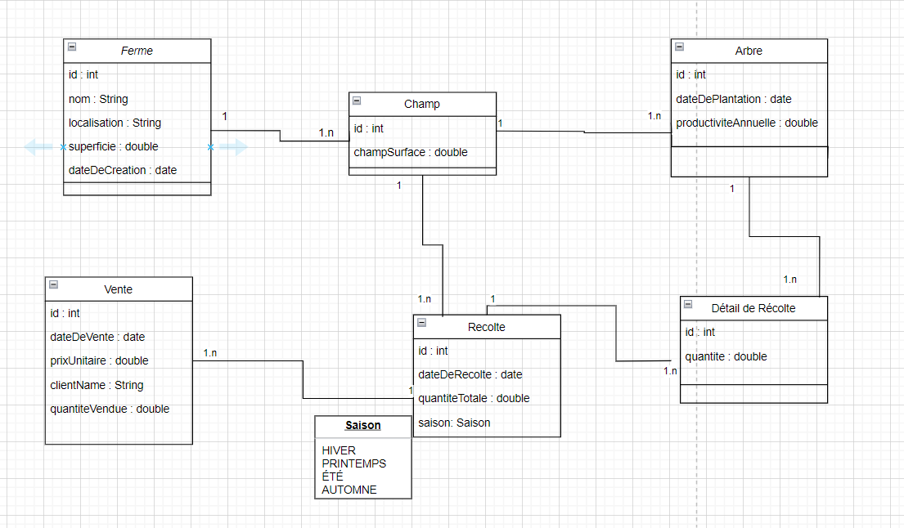

# Citronix

## Contexte du Projet
Le projet **Citronix** est une application de gestion dédiée aux fermes de citrons. Elle permet aux fermiers de suivre efficacement la production, la récolte et la vente de leurs produits tout en optimisant la gestion des fermes, des champs, des arbres, des récoltes et des ventes. L'objectif est d'améliorer la productivité et de simplifier les processus de gestion agricole.

---

## Fonctionnalités Principales

### Gestion des Fermes
- Création, modification et consultation des informations d'une ferme (nom, localisation, superficie, date de création).
- Recherche multicritère des fermes avec **Criteria Builder**.

### Gestion des Champs
- Association de champs à une ferme avec gestion des superficies.
- Validation : La somme des superficies des champs doit être strictement inférieure à celle de la ferme.

### Gestion des Arbres
- Suivi des arbres avec leur date de plantation, leur âge, et leur champ d'appartenance.
- Calcul de l'âge des arbres.
- Gestion de la productivité des arbres par saison :
    - **Arbre jeune (< 3 ans)** : 2,5 kg/saison.
    - **Arbre mature (3-10 ans)** : 12 kg/saison.
    - **Arbre vieux (> 10 ans)** : 20 kg/saison.

### Gestion des Récoltes
- Suivi des récoltes par saison (hiver, printemps, été, automne).
- Limitation : Une seule récolte par saison (tous les 3 mois).
- Enregistrement de la date et de la quantité totale récoltée.

### Détails des Récoltes
- Suivi de la quantité récoltée par arbre pour une récolte donnée.
- Association de chaque détail de récolte à un arbre spécifique.

### Gestion des Ventes
- Enregistrement des ventes avec la date, le prix unitaire, le client, et la récolte associée.
- Calcul automatique du revenu :  
  `Revenu = quantité * prix unitaire`.

---

## Contraintes
- **Superficies des champs** :
    - Minimum : 0.1 hectare (1 000 m²).
    - Maximum : 50 % de la superficie totale de la ferme.
- **Nombre maximal de champs** : 10 champs par ferme.
- **Densité des arbres** : Maximum 100 arbres par hectare.
- **Durée de vie des arbres** : Un arbre est productif jusqu'à 20 ans.
- **Période de plantation** : Entre mars et mai uniquement.
- **Récoltes** :
    - Un champ ne peut être associé qu'à une seule récolte par saison.
    - Un arbre ne peut être inclus dans plus d’une récolte pour une même saison.

---

## Exigences Techniques
- **Framework** : Spring Boot pour créer l'API REST.
- **Architecture** : En couches (Controller, Service, Repository, Entity).
- **Validation des données** : Via les annotations Spring.
- **Gestion centralisée des exceptions**.
- **Conception** :
    - Utilisation des interfaces et de leur implémentation.
    - Pattern Builder avec Lombok pour la gestion des entités.
    - Conversion entre entités, DTO et View Models avec **MapStruct**.
- **Tests** :
    - Tests unitaires avec **JUnit** et **Mockito**.

---

## Installation et Démarrage

1. Clonez ce dépôt :
   ```bash
   git clone https://github.com/votre-utilisateur/citronix.git
  
 2. Accédez au dossier du projet :
   ````bash
    cd citronix
````
 3. Compilez et packagez l'application dans un fichier JAR :
   ```bash
    mvn clean package
  ````

 4. Exécutez le fichier JAR généré :

 ```bash
    java -jar target/citronix-1.0.0.jar
  ````


### Conception UML
## Diagramme de classe :

### Planification JIRA

[Backlog Jira du projet](https://akilsalaheddine203.atlassian.net/jira/software/projects/CIT/boards/5/timeline?shared=&atlOrigin=eyJpIjoiNDA1MjFhNzFkODM0NGZkNjgxNmVlM2JhYTk5ZjExNjAiLCJwIjoiaiJ9)

   